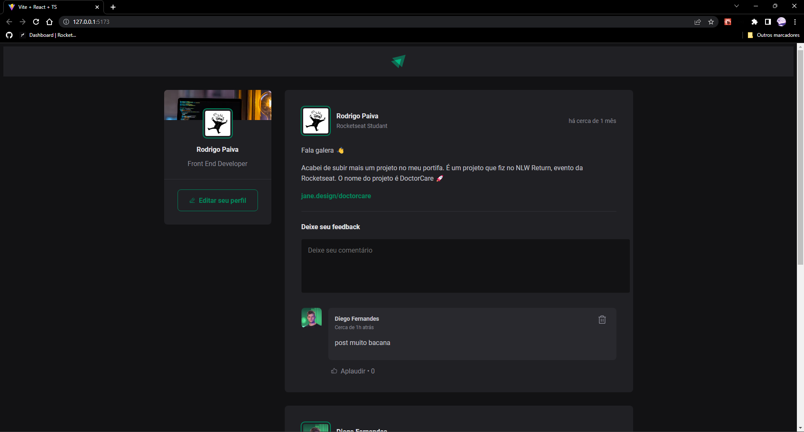

<h1 align="center">ReactJS - Ignite Rocketseat</h1>

Projeto criado usando [Vite](https://vitejs.dev/)


<h1 align="center">Dependencias</h1>

``` css

  npm i phosphor-react

```

Lib de icones para a aplicação [aqui](https://github.com/phosphor-icons/phosphor-home)


``` css
  
  npm i date-fns
  
```


Formatar datas em JavaScript


Template no [Figma](https://www.figma.com/file/w3wk6JDgUalKlXjdfiAIUR/Ignite-Feed-(Community)?node-id=0%3A1&t=l8ll824txsWkEvxu-0)




# Key no React

## Por que única?

3 momentos em que um componente é renderizado, novamente, no React.

1 - Quando o estado é alterado
2 - Quando a propriedade altera
3 - Quando um componente pai renderiza novamente


-----
1, 2, 3, 4
-------

1, 2, 3, 4, 5
-------

Ignora os já existentes e renderiza somente os novos


## Por que não utilizar o índice de array como chave

``` js
  const posts = [1, 4, 3, 2]
  // 1, 4, 3, 2
```
Alterando a posição do indice o react precisa renderizar tudo de novo, com a chave ele não precisa renderizar pq torna o elemento único

Projeto desenvolvido na trilha Ignite da Rocketseat :purple_heart:
